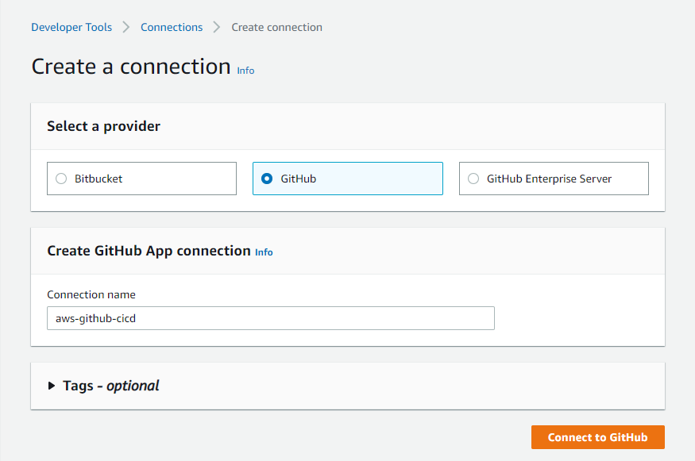
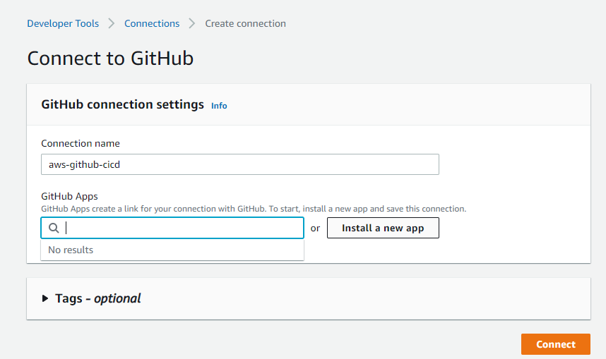
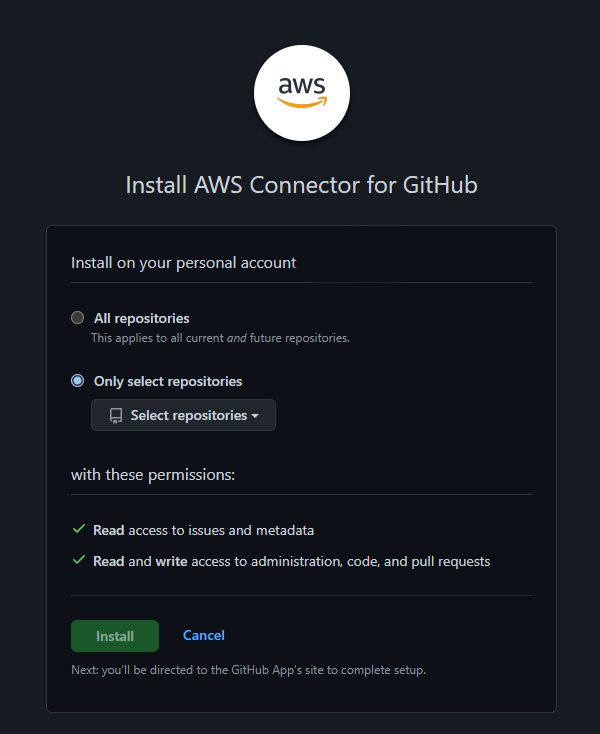
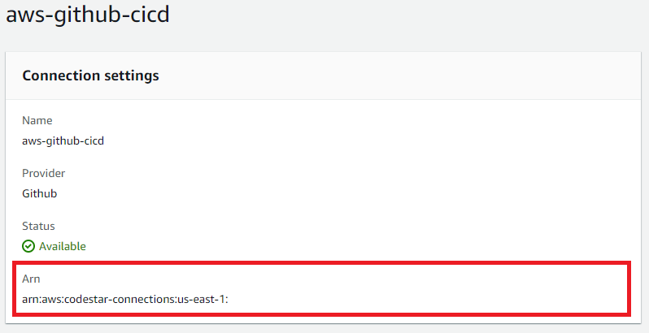

# aws-codepipeline-template
A template for SAM pipeline using the GitHub 2.0 connection. The template is based off [the following repo/template](https://github.com/awslabs/aws-sam-codepipeline-cd) but updated to use the GitHub 2.0 connection option. Refer to the repo readme for the general structure of the pipeline as well as a description of the common parameters needed.

## Installation
You can use the [template.yaml](template.yaml) file in this repo as the cloudformation template to launch your stack. You will need to creat a connection to your GitHub account using the GitHub app and note the ARN for your connection. See below for the steps to create the connection using the AWS Console.

### Connecting to GitHub using GitHub Apps
AWS recommends using the GitHub (Version 2) connection if using GitHub as the source for your pipeline. [AWS Documentation can be found here on creating a new connection](https://docs.aws.amazon.com/codepipeline/latest/userguide/connections-github.html):

Using the create a connection option in the Developer Tools menu (Under Settings > Connections), select GitHub and enter a connection name.

Click the button to Install a new app and a pop up window will appear

Connect to all or the repositories you wish to use in your pipeline.

When you return to the AWS window, you'll see an ARN for the connection you created. Copy this ARN and paste it into the `GitHubConnectionArn` parameter in the template for your pipeline to use.

### Parameters

The following parameters are added 

| Parameter     | Required      | Description   |
| ------------- | ------------- | ------------- |
| SNSTopic  | Optional  | The SNS Topic name you want the deploy step to publish to. |
| GitHubConnectionArn  | Required  | The ARN of the connection you created for Codepipeline to use as the source for your pipeline. |